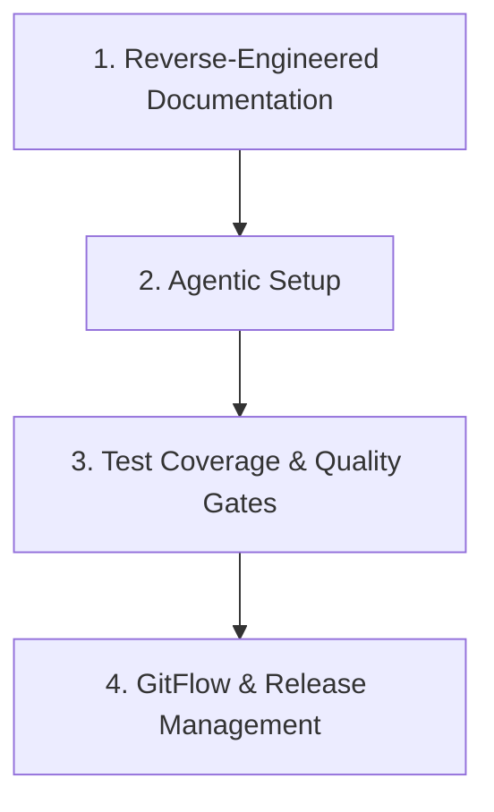

# 🚀 Agentic Repo Setup Skill

A self-contained, 4-pillar agentic bootstrapper for software repositories. Automatically reverse-engineers documentation, scaffolds AI agent rules and workflow skills, establishes test coverage frameworks, and configures GitFlow workflows for **Claude Code CLI**, **Antigravity / AGY**, **Cursor**, **Windsurf**, and **Codex**.

---

## 🏛 The 4 Pillars



1. **📄 Reverse-Engineered Documentation**:
   - `docs/PRD.md` (Product Requirements Document)
   - `docs/RFC.md` (Architecture Proposal & Trade-offs)
   - `docs/FDD.md` (Functional Design Spec + **Embedded Mermaid/C4 Diagrams**)
   - `docs/adrs/ADR-001-*.md` (Architecture Decision Records)
   - `docs/TRACKER.md` (Line-level Traceability Matrix mapping requirements to code lines `file.ext#Lnn`)
2. **🤖 Universal Agent Setup**:
   - Lightweight entrypoint guides (`AGENTS.md` & `CLAUDE.md`) referencing `CONTEXT.md` as the single source of truth
   - Authoritative repository context, documentation-first policy, and workflows in `CONTEXT.md`
   - Scoped workspace rules (`restricao_escopo.md`, `security_zero_trust.md`, `gitflow_conventions.md`, `architecture_conventions.md`)
   - Complete `.claude/` system (12 `design-docs-*` commands, 12 `design-docs-*` skills, 5 core documentation rules)
3. **🧪 Test Coverage & Quality Gates**:
   - Automated test framework detection (Vitest, Jest, PyTest, Go test, JUnit)
   - Initial unit test scaffolding for core calculation/service modules
4. **🌿 GitFlow & Release Management**:
   - GitFlow branching strategy (`main`, `dev`, `feature/*`, `bugfix/*`)
   - Conventional Commits (`feat:`, `fix:`, `docs:`, `refactor:`, `test:`, `chore:`)
   - Pull Request templates (`.github/PULL_REQUEST_TEMPLATE.md`)

---

## 📦 Directory Structure

```
agentic-repo-setup/
├── SKILL.md                             # Primary skill instructions & frontmatter
├── README.md                            # Repository documentation
├── .gitignore                           # Git ignore rules
└── templates/                           # Embedded, zero-dependency templates
    ├── AGENTS.md.template               # AGENTS.md template
    ├── CLAUDE.md.template               # CLAUDE.md template
    ├── CONTEXT.md.template              # CONTEXT.md template
    ├── architecture.md.template         # docs/architecture.md template
    ├── docs/                            # PRD, RFC, FDD, ADR, TRACKER templates
    ├── rules/                           # Scope boundary, security, gitflow, doc rules
    ├── skills/                          # Action skills & refactoring suite (refactor-arch)
    ├── commands/                        # 12 design-docs-* commands
    ├── references/                      # Architecture, documentation, codebase references
    ├── guidelines/                      # Methodological guidelines
    └── requirements/                    # Deliverables profiles
```

---

## ⚡ Triggers & Usage

Invoke this skill in any repository using slashed commands or natural language:
- `/agentic-repo-setup`
- `setup agentic repo`
- `prepare repo for ai`
- `agentic setup`

---

## 🔒 Security & Gitleaks Compliance
All embedded templates and sample keys use safe, low-entropy placeholders (`<YOUR_API_KEY>`, `your_secret_key_placeholder`, `REPLACE_WITH_YOUR_KEY`) to guarantee zero false positives in `gitleaks` security scans and pre-commit hooks.
